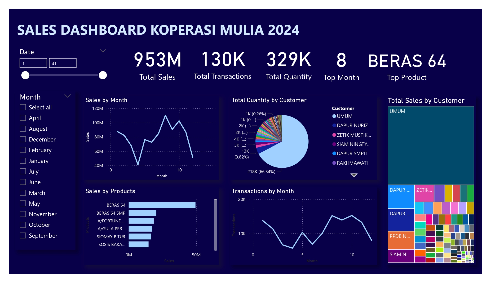

# 📊 Retail Sales Dashboard - Power BI

## 📌 Project Overview
This project develops a Business Intelligence dashboard for Koperasi Mulia to analyze sales transactions and customer purchasing patterns.

## 🎯 Objectives
- Monitor sales performance
- Identify top-selling products
- Analyze customer contribution
- Support strategic decision-making

## 🛠️ Tools & Technologies

  
  
  
  

## 🔄 ETL Process
1. Extract sales transaction data from Excel
2. Transform data using Power Query
3. Load data into Power BI model

## 📈 Dashboard Features
- Monthly sales trends
- Customer contribution analysis
- Product performance analysis
- Transaction monitoring

## 💡 Key Insights
- Top product: Beras 64
- Peak sales month identified
- Customer purchasing distribution visualized

## 🖼️ Dashboard Preview

## 🚀 Project Impact
This dashboard helps support data-driven decision-making by providing interactive visualizations and clearer business insights for sales analysis.
